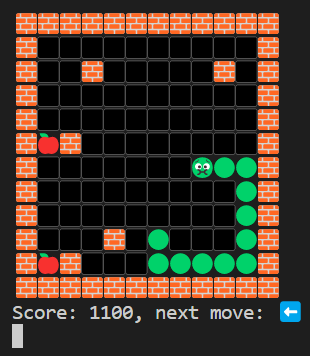

# go-snakes-game

Sample Project for Learning GO

## Installation

1. [install go](https://go.dev/dl/) first

2. clone and run

```bash
git clone https://github.com/bumprat/go-snakes-game.git
cd ./go-snakes-game
go run .
```



## Controls

use `arrow keys` to change direction

`esc` to end game

## Dependencies

[github.com/eiannone/keyboard](github.com/eiannone/keyboard)
